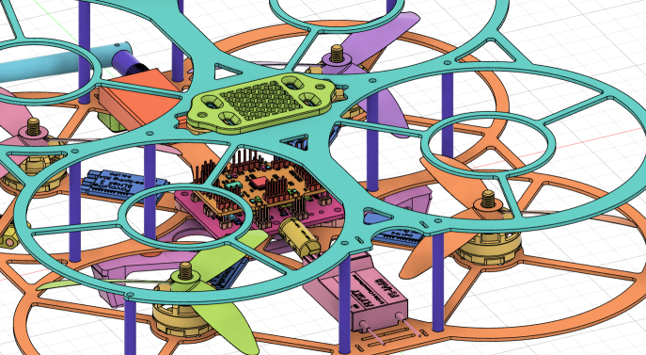
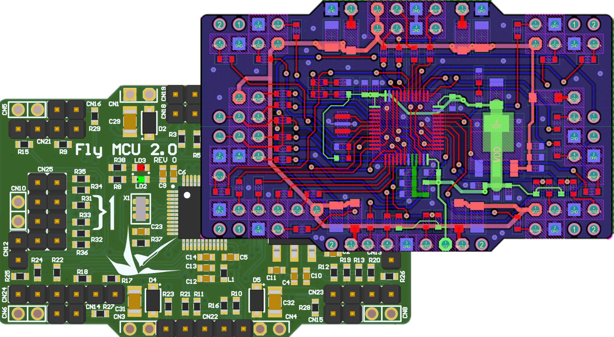
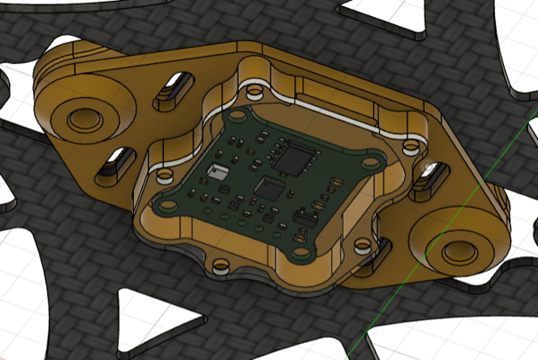

# БПЛА для хакатона Cyber Garden Drone

Здрассссьте и добро пожаловать на хакатон! Вам будет предложено ознакомиться с нашим БПЛА, специально спроектированным для этого мероприятия и выполнить кейс, предложенный организаторами.

## Основные компоненты

Перечень компонентов, которые мы разработали:

### Полётный контроллер **Fly MCU 2.0**

Полётный контроллер выполнен на базе микроконтроллера **STM32G431**. Микропрограммное обеспечение также является собственным решением и доступно Вам в данном репозитории. Контроллер выполнен в модульной архитектуре - инерциальное измерительное устройство вынесено в отдельный виброразвязанный блок, что позволяет улучшить качество стабилизации и навигации.

Сам полетный контроллер выполнен с расчётом на дальнейшую интеграцию в БПЛА с различными системами - для этого вам доступны следующие интерфейсы, которые вы можете использовать в любом сценарии:
- 4 **UART**'а с реализованными для них протоколами *MavLink*, *S-Bus*, *CSRF*
- **I2C** в блоке **IMU**, **I2C** с полностью свободной линией
- **SPI-интерфейс**
- **GPIO** с **ADC**
В добавок - есть возможность реконфигурации. Так, к примеру, разъём **SPI-интерфейса** можно переконфигурировать под обычный **GPIO** или другую свободную периферию.

#### Доступные ресурсы

- [Принципиальная схема устроиства](./doc/MCU%20sch.pdf)
- [Инициализация тактирования и периферии в STM32CubeMX](./Cube32/FlightController_v2.0.ioc)
- [Reference Manual на МК](./doc/STM32G4%20RM.pdf)
- [DS на МК](./doc/STM32G431CBT6.pdf)
- и другие документы, доступные на [сайте производителя МК](https://www.st.com/en/microcontrollers-microprocessors/stm32g431cb.html)

### Плата распределения питания **Fly POW 2.0**

Плата распределения питания, позволяющая удобно подключить 4 ESC-регулятора для двигателей и запитать всё, что есть на БПЛА.

#### Основные функции

- Распределение питания от АКБ на двигатели и периферию
- Питание всей бортовой электроники. Для этого на плате установлены **4** (!) синхронных DC-DC преобразователя, выдающие по 3 Ампера каждый
- Делитель напряжения, позволяющий полётному контроллеру получить информацию о остаточном заряде АКБ для дальнейшего прогнозирования времени полёта

Стоит также отметить, что периферия полётного контроллера запитывается сразу от 4-х источников, что максимально повышает надежность, т.к. жизненноважные компоненты подключены именно к полётному контроллеру.

#### Доступные ресурсы

- [Принципиальная схема устроиства](./doc/PDB%20sch.pdf)
- [DS на ST1S10](./doc/ST1S10.pdf)

### IMU-блок **Fly IMU 2.0**

IMU-блок дополненный барометром, позволяющий вычислять наклоны БПЛА, находить барометрическую высоту и использовать данные для фильтрации позиции.

#### Основные компоненты блока

- Гироскоп
- Акселерометр
- Магнетометр
- Барометр
- EEPROM-память для сохранения калибровочных данных

#### Доступные ресурсы

- [Принципиальная схема устроиства](./docIMU-module%20sch.pdf)
- [DS на 24LC32A](./doc/24LC32A.pdf)
- [DS на BMP280](./doc/BMP280.pdf)
- [DS на BMP280](./doc/ICM-20948.pdf)

## Другая информация

- [Инструкция по сборке](doc/Инструкция%20по%20сборке.pdf)
- [Инструкция по подключению RC-приёмопередатчика](doc/RC/RC.md)
- Еще можно призвать кого-нибудь из экспертов. Они должны находиться на площадке (но не круглые сутки)