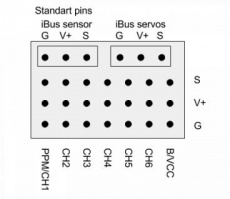
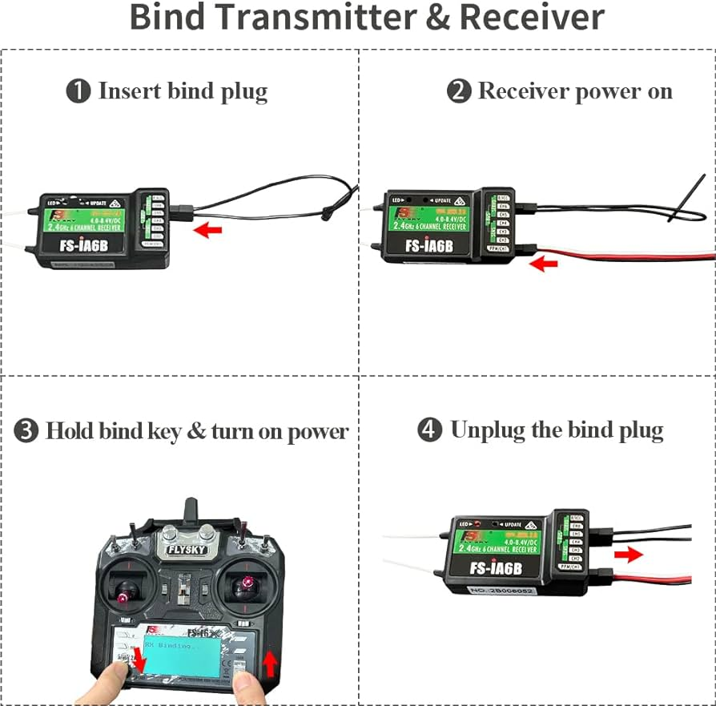
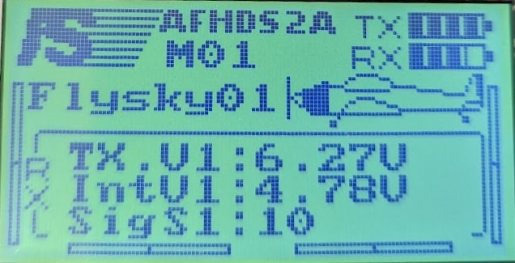
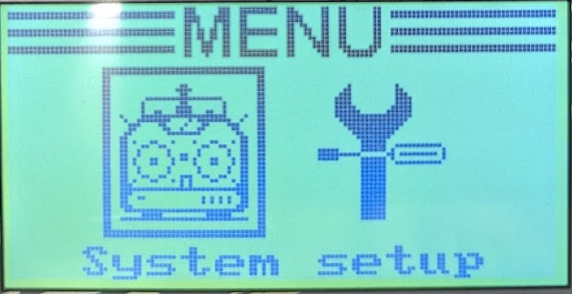
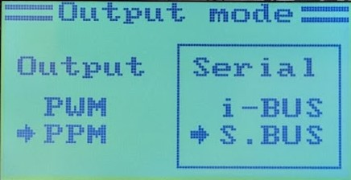
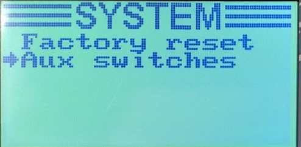
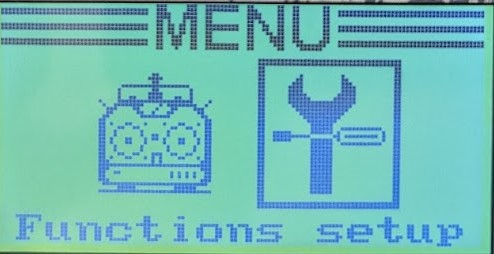
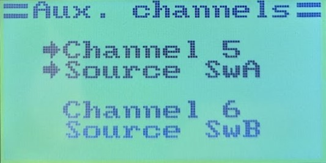
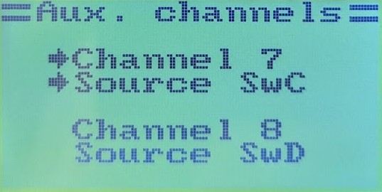
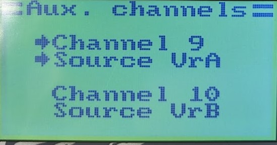

# Настройка пульта

Данный раздел описывает минимально необходимые действия, которые необходимы для подключения пульта к *Fly MCU 2.0*.

**ВЫПОЛНЯТЬ С СТРОГО ОТКЛЮЧЕННЫМИ ESC ОТ ПЛАТЫ ИЛИ СО СНЯТЫМИ ВИНТАМИ**

## Шаг 0. Подключение приёмника

Установите приёмник на любое удобное место в БПЛА. Закрепите также и антенны так, что бы они не попали в винты.

Затем возьмите 3 провода мама-мама и подключите их в разъём ***iBus servos*** (верхний правый угол).

Подключение к *Fly MCU 2.0* выполняется по следующей схеме:
| FS-iA6B, *iBus servos* | Fly MCU 2.0, *RC UART* |
| ---------------------- | ---------------------- |
| G                      | GND                    |
| V+                     | +5V                    |
| S                      | RX                     |

Если, как минимум, **GND** и **+5V** были подключены правильно, при подключении питания загорится индикатор на приёмнике, сигнализирующий о наличии питания.

## Шаг 1. Привязка приёмника к передатчику

Затем необходимо обесточить БПЛА. Воткните bind-кабель (при отсутствии можно обычным кабелем мама-мама) в крайний правый разъём **B/VCC** приёмника.

(!) Предыдущее подключение остаётся на месте, шаги 2 и 4 с изображения не актуальны.

Убедитесь, что отключен и БПЛА, и пульт. Затем зажав **bind-key** включите передатчик. Вы должны увидеть надпись *RX Binding...*.

Затем включите БПЛА. Если все шаги были выполнены успешно, вы увидите экран с качеством сигнала и напряжением.

## Шаг 2. Настройка выхода

Удержанием кнопки **OK** (правее дисплея) зайдите в системное меню и кнопками **UP/DOWN** (левее дисплея) выберете пункт **System setup**.

Найдите пункт **RX Setup**...

затем **Output mode**...

Затем в Serial необходимо выбрать **S.BUS**.

Выход с сохранением - долгое удержание **CANCEL**!!! Лучше потом еще раз зайти в ту менюшку и проверить верность выставленных параметров.

## Шаг 3. Включение всех каналов

Удержанием кнопки **OK** (правее дисплея) зайдите в системное меню и кнопками **UP/DOWN** (левее дисплея) выберете пункт **System setup**.

Найдите пункт **Aux switches**...

и выставите следующие настройки:

Выход с сохранением - долгое удержание **CANCEL**!!! Лучше потом еще раз зайти в ту менюшку и проверить верность выставленных параметров.

## Шаг 4. Включение всех каналов

Удержанием кнопки **OK** (правее дисплея) зайдите в системное меню и кнопками **UP/DOWN** (левее дисплея) выберете пункт **Functions setup**.

Найдите пункт **Aux. channels**...

и установите соответствия между каналами и органами управления

Выход с сохранением - долгое удержание **CANCEL**!!! Лучше потом еще раз зайти в ту менюшку и проверить верность выставленных параметров.

# The end

После выполнения этих пунктов у Вас появится возможность управлять БПЛА а также использовать этот пульт для своих целей - Вам будет доступно сообщение **RC_CHANNELS_RAW (35)** из протокола **MavLink**, где вы можете получить позицию стиков/тумблеров/потенциометров. 